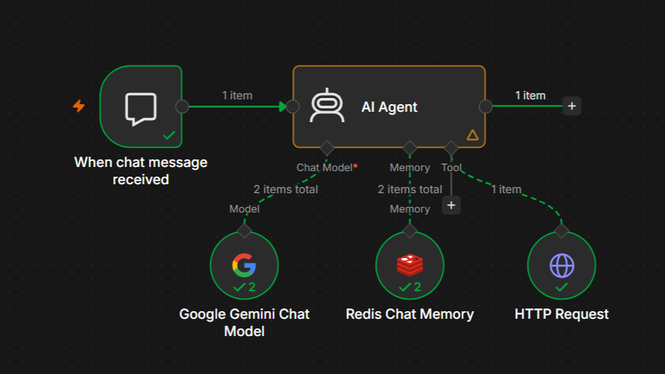
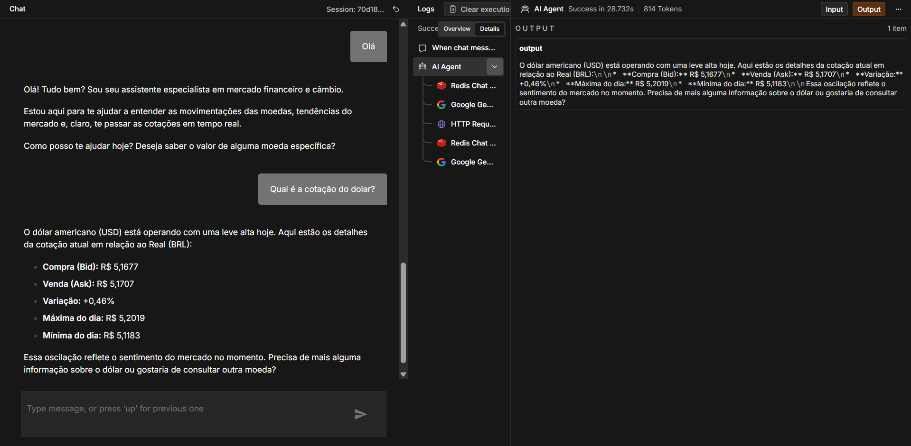

# 💱 Agente de IA para Cotação de Moedas (n8n)
[Translate to English](https://github.com/sthefanyalaminos/agent-currency-exchange/blob/main/README_EN.md)

Automação low-code construída no n8n: Agente de IA especialista em finanças e câmbio, com memória de conversa e capacidade de consultar cotações de moedas em tempo real.




---
O agente conversa em linguagem natural sobre câmbio e finanças. Sempre que o usuário pergunta pela cotação de uma moeda, o agente usa HTTP Request para buscar o valor atualizado na AwesomeAPI antes de responder, para consultar dados reais. Além disso, o agente mantém o histórico da conversa através de memória persistente no Redis, permitindo diálogos com contexto.

---

## Como funciona
```
Usuário envia mensagem no chat
        │
        ▼
 ┌────────────────────── AI Agent ──────────────────────┐
 │                                                        │
 │   🧩 Google Gemini Chat Model  → gera as respostas     │
 │   💾 Redis Chat Memory         → mantém o contexto     │
 │   🌐 HTTP Request Tool         → busca cotações reais  │
 │      (AwesomeAPI)                 quando necessário    │
 │                                                        │
 └────────────────────────────────────────────────────────┘
        │
        ▼
   Resposta ao usuário
```
1. O usuário envia uma pergunta pelo chat (ex: "qual a cotação do dólar hoje?").
2. O **AI Agent** (LangChain Agent node) recebe a mensagem e decide, com base no seu system prompt, se precisa consultar uma cotação.
3. Se precisar, ele aciona a tool **HTTP Request**, que consulta a **AwesomeAPI** e retorna o valor atualizado da moeda.
4. O **Google Gemini** (via Google AI API) gera a resposta final em linguagem natural, usando o resultado da consulta.
5. O **Redis Chat Memory** guarda o histórico da conversa, para que o agente lembre do contexto em mensagens seguintes.

## Tecnologias 
| Camada | Ferramenta |
|---|---|
| Orquestração | [n8n](https://n8n.io) |
| LLM | Google Gemini (via Google AI API) |
| Memória | Redis |
| Dados de câmbio | [AwesomeAPI - Economia](https://docs.awesomeapi.com.br/) |

## Como importar e rodar
1. Tenha uma instância do n8n rodando (local, self-hosted ou n8n Cloud).
2. No n8n, vá em **Workflows → Import from File** e selecione o `workflow.json` deste repositório.
3. Configure as credenciais indicadas na seção abaixo (Google Gemini, Redis e, opcionalmente, o token da AwesomeAPI).
4. Ative o workflow e converse com o agente pelo chat do n8n.

## Credenciais e variáveis de ambiente
 
Veja o arquivo [`.env.example`](./.env.example) para a lista completa. Resumo:
 
| Variável | Onde usar no n8n | Obrigatório? |
|---|---|---|
| `GEMINI_API_KEY` | Credencial "Google Gemini(PaLM) Api account" | ✅ Sim |
| `REDIS_HOST` / `REDIS_PORT` / `REDIS_PASSWORD` | Credencial "Redis account" | ✅ Sim |
| `AWESOMEAPI_TOKEN` | Query param `token` na URL do node HTTP Request | ⚠️ Opcional* |
 
\* *A AwesomeAPI funciona sem token, mas as respostas ficam em cache de 1 minuto. Com um token gratuito, você tem até 100 mil requisições/mês sem cache. Gere o seu em [awesomeapi.com.br](https://awesomeapi.com.br).*
 
> ⚠️ **Nota de segurança:** o `workflow.json` exportado pelo n8n **não** inclui os valores reais das credenciais (Gemini/Redis ficam apenas como referência).

## Autoria
Desenvolvido por Sthefany Alaminos.